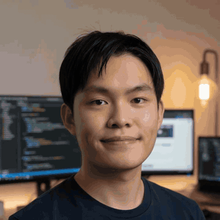

  

# Paul Wong

Full-stack software engineer in Malaysia. I ship product systems end-to-end — REST APIs, PostgreSQL, and React UIs — in **Rust (Axum)**, **Java (Spring Boot)**, **Go**, and **TypeScript**. I am completing an MSc in Artificial Intelligence at [Sunway University](https://sunwayuniversity.edu.my/).

**Open to work** — full-stack software engineering roles in Malaysia or remote.

## Featured work

| Project | What it is |
|---|---|
| [payroll-system](https://github.com/siewong007/payroll-system) | Payroll and HR for Malaysian SMEs: statutory contributions, approvals, attendance. Rust (Axum), React, PostgreSQL. |
| [hotel-app](https://github.com/siewong007/hotel-app) | Hotel administration panel — rooms, bookings, staff RBAC. Rust, React, and a Tauri desktop shell. |
| [banking-app](https://github.com/siewong007/banking-app) | Personal banking and finance with WebAuthn passkeys, PostgreSQL, and fraud/insights MCP servers. |
| [inventory-crm](https://github.com/siewong007/inventory-crm) | Multi-warehouse inventory CRM: purchase/sales orders and automatic stock movements. Go, React, PostgreSQL. |
| [mlops-credit-card-fraud-detection](https://github.com/siewong007/mlops-credit-card-fraud-detection) | Reproducible fraud-detection pipeline: Pandera validation, MLflow, DVC, SHAP, Evidently. |
| [agent-kv-retention](https://github.com/siewong007/agent-kv-retention) | MSc thesis experiments: KV-cache retention for LLM agent workloads, costed in ringgit rather than hit rate. |

## Stack

**Backend** — Rust (Axum), Java (Spring Boot), Go  
**Frontend** — TypeScript, React, Vite, Tauri  
**Data** — PostgreSQL, Redis, SQLite  
**ML / ops** — Python, MLflow, DVC, Docker, GitHub Actions, Terraform

## Contact

- [LinkedIn](https://www.linkedin.com/in/paul-wong-02864a19a)
- GitHub [@siewong007](https://github.com/siewong007)
